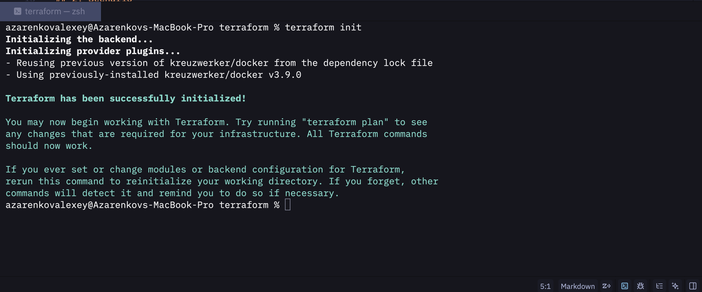
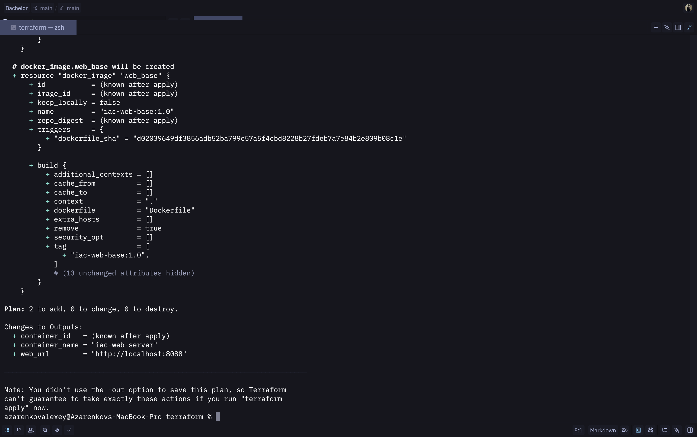
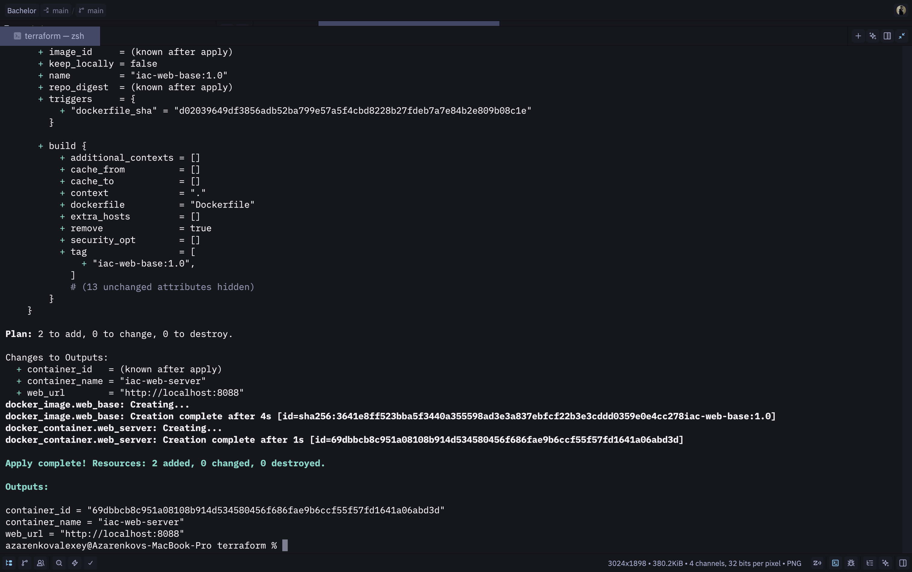
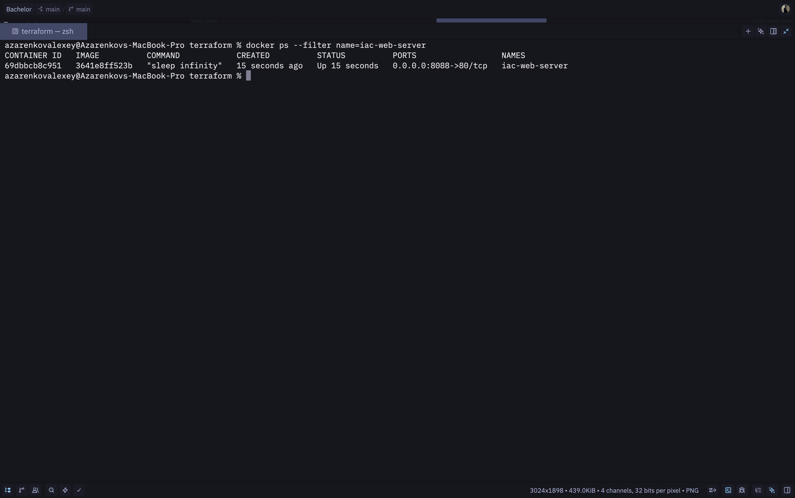
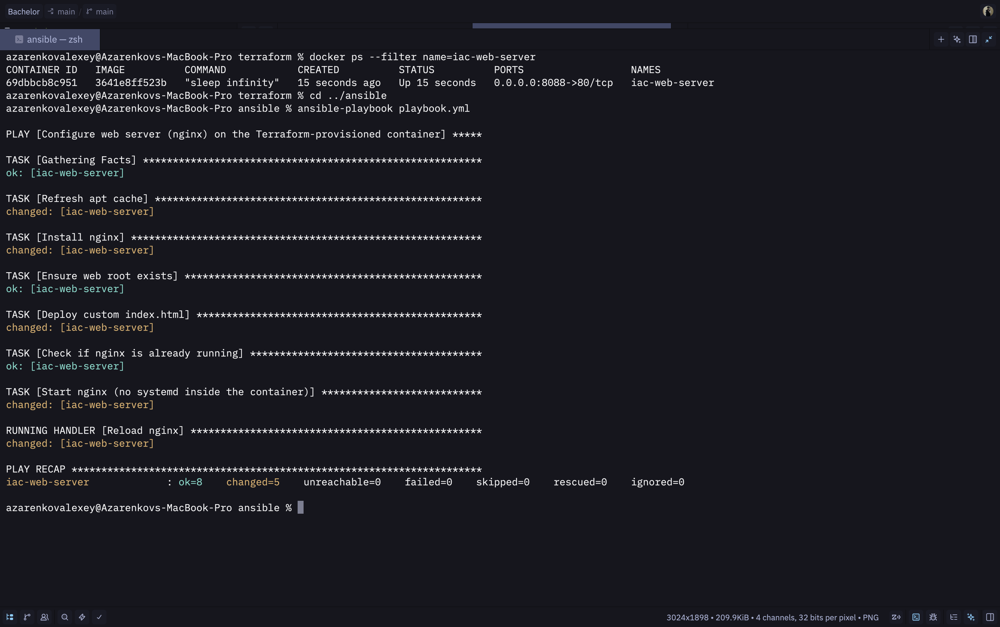
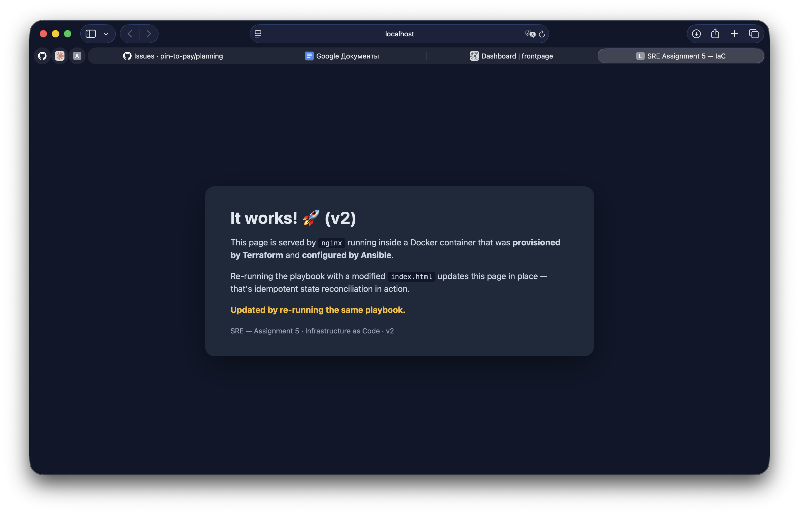
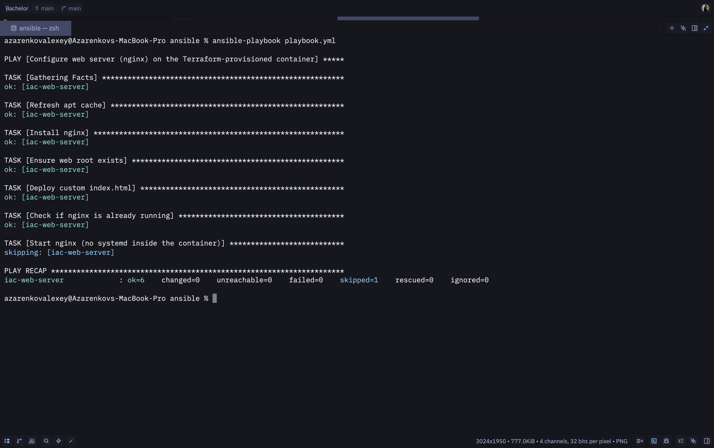
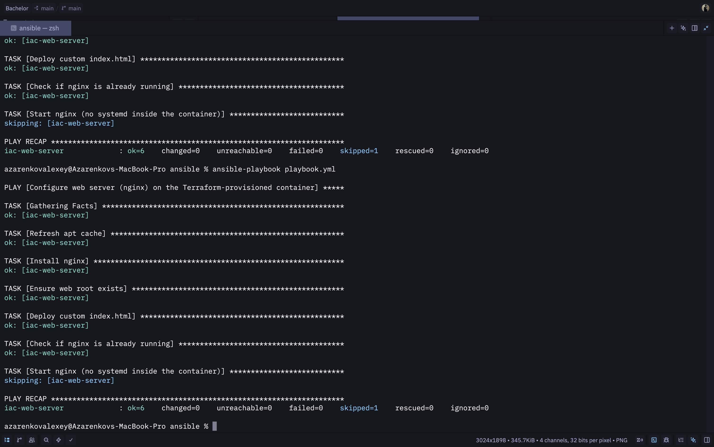
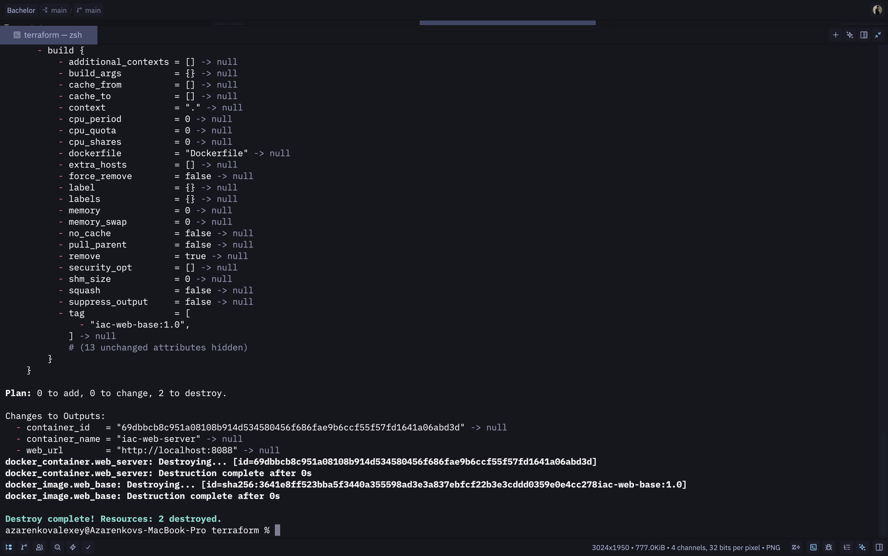
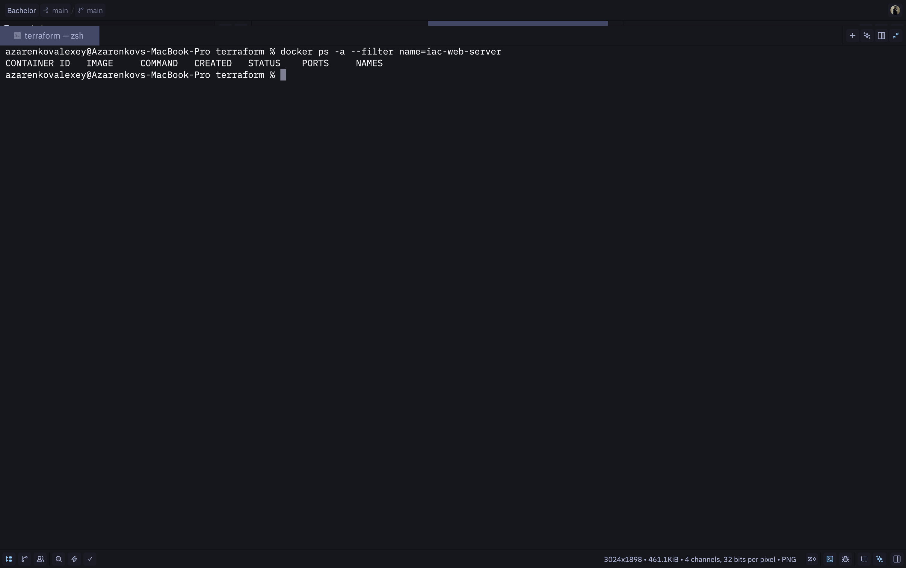

# Assignment 5 — Implementing Infrastructure as Code (IaC)

**Course:** SRE
**Author:** Alexey Azarenkov

---

## 1. Objective

Eliminate manual infrastructure setup by applying Infrastructure-as-Code principles.
The lab provisions a Linux host **declaratively with Terraform** and configures it
**automatically with Ansible**, then validates that re-running the same code produces
no unintended changes (idempotent state reconciliation).

## 2. Scenario

A company currently provisions web servers manually, leading to configuration drift and
undocumented states. The goal of this assignment is to automate the entire lifecycle of
a web server — from creating the host to deploying nginx with a custom landing page —
so that the desired state lives in version-controlled code and not in someone's memory.

## 3. Architecture

```
                         assignment-5/
                         ├── terraform/
                         │   ├── main.tf       (Docker provider — image + container)
                         │   └── Dockerfile    (Ubuntu 22.04 + python3 for Ansible)
                         └── ansible/
                             ├── ansible.cfg
                             ├── inventory.ini (community.docker.docker connection)
                             ├── playbook.yml  (apt install nginx, copy index.html)
                             └── files/index.html

  $ terraform apply           $ ansible-playbook playbook.yml
  ┌─────────────────────┐    ┌──────────────────────────────┐
  │  docker_image       │    │  refresh apt cache           │
  │  docker_container ──┼───▶│  apt install nginx           │
  │  (port 8088 → 80)   │    │  copy custom index.html      │
  └─────────────────────┘    │  start nginx (no systemd)    │
                             │  reload on changes (handler) │
                             └──────────────────────────────┘
```

The Terraform module provisions a Docker container running Ubuntu 22.04 with `python3`
preinstalled (so Ansible can target it via the `community.docker.docker` connection
plugin without SSH). The container exposes port 80 on host port **8088**. Ansible then
installs nginx, deploys a custom `index.html`, starts the daemon and reloads it on
configuration changes.

A Docker provider was chosen instead of a cloud provider (AWS / Azure / GCP) so the
lab is fully reproducible offline — no credentials, no costs, identical workflow.

## 4. Tools & versions

| Tool | Version | Role |
|---|---|---|
| Terraform | 1.14.x | Provisioning (declarative `init/plan/apply/destroy` workflow) |
| `kreuzwerker/docker` provider | 3.9 | Talks to the Docker daemon |
| Ansible (`ansible-core`) | 2.20 | Configuration management |
| `community.docker` collection | bundled | `docker` connection plugin (no SSH) |
| Docker Engine | 28.x (OrbStack) | Container runtime that hosts the "server" |
| Ubuntu (image) | 22.04 LTS | Operating system inside the container |

---

## 5. Step 1 — Infrastructure Provisioning (Terraform)

### 5.1 Description

Two Terraform resources fully describe the infrastructure:

- **`docker_image.web_base`** builds a small custom image from `terraform/Dockerfile`
  (Ubuntu 22.04 + `python3` + `python3-apt`, required for Ansible's `apt` module).
  The `triggers = { dockerfile_sha = filesha256(...) }` block forces Terraform to
  rebuild the image whenever the `Dockerfile` content changes — without it Terraform
  would consider the resource unchanged because the resource arguments (`name`, `build`)
  are textually identical.
- **`docker_container.web_server`** starts a long-running container from that image,
  publishes the internal port `80` on host `8088`, sets `restart = "unless-stopped"`
  and tags the resource with `managed-by=terraform` / `assignment=sre-assignment-5`
  labels so it's easy to spot among other containers.

The `provider "docker"` block accepts an optional `docker_host` variable so the same
configuration works on Docker Desktop, Colima, OrbStack, etc. Outputs expose the
container name, container ID and the URL where the configured server will be served.

### 5.2 Source code — `terraform/main.tf`

```hcl
terraform {
  required_version = ">= 1.5.0"
  required_providers {
    docker = { source = "kreuzwerker/docker", version = "~> 3.0" }
  }
}

variable "docker_host"    { type = string; default = "" }
variable "container_name" { type = string; default = "iac-web-server" }
variable "host_http_port" { type = number; default = 8088 }
variable "image_tag"      { type = string; default = "iac-web-base:1.0" }

provider "docker" {
  host = var.docker_host != "" ? var.docker_host : null
}

resource "docker_image" "web_base" {
  name = var.image_tag

  build {
    context    = path.module
    dockerfile = "Dockerfile"
    tag        = [var.image_tag]
  }

  keep_locally = false

  triggers = {
    dockerfile_sha = filesha256("${path.module}/Dockerfile")
  }
}

resource "docker_container" "web_server" {
  name     = var.container_name
  image    = docker_image.web_base.image_id
  hostname = var.container_name
  restart  = "unless-stopped"

  ports { internal = 80; external = var.host_http_port }

  labels { label = "managed-by"; value = "terraform" }
  labels { label = "assignment"; value = "sre-assignment-5" }
}

output "container_name" { value = docker_container.web_server.name }
output "container_id"   { value = docker_container.web_server.id }
output "web_url"        { value = "http://localhost:${var.host_http_port}" }
```

### 5.3 Source code — `terraform/Dockerfile`

```dockerfile
FROM ubuntu:22.04

ENV DEBIAN_FRONTEND=noninteractive

RUN apt-get update \
    && apt-get install -y --no-install-recommends \
        python3 \
        python3-apt \
        ca-certificates \
        tzdata \
    && rm -rf /var/lib/apt/lists/*

CMD ["sleep", "infinity"]
```

### 5.4 Workflow

```bash
cd terraform
terraform init
terraform plan
terraform apply -auto-approve
```

### 5.5 Screenshots

**Screenshot 1 — `terraform init`**
Shows the `kreuzwerker/docker` provider being downloaded and "Terraform has been
successfully initialized!".



**Screenshot 2 — `terraform plan`**
Ends with `Plan: 2 to add, 0 to change, 0 to destroy.`



**Screenshot 3 — `terraform apply`**
Ends with `Apply complete! Resources: 2 added, 0 changed, 0 destroyed.`
and prints the three outputs (`container_id`, `container_name`, `web_url`).



**Screenshot 4 — `docker ps --filter name=iac-web-server`**
Confirms the container is running and `0.0.0.0:8088->80/tcp` is published.



---

## 6. Step 2 — Configuration Management (Ansible)

### 6.1 Description

Ansible connects to the Terraform-provisioned container with the
`community.docker.docker` connection plugin, which executes modules over `docker exec`
instead of SSH — perfect for a local lab where setting up sshd inside a container
would be unnecessary ceremony.

The playbook applies six declarative tasks:

1. **Refresh apt cache** — `ansible.builtin.apt: update_cache=true`
2. **Install nginx** — `ansible.builtin.apt: name=nginx state=present`
3. **Ensure web root exists** — `ansible.builtin.file: state=directory mode=0755`
4. **Deploy custom index.html** — `ansible.builtin.copy: src=files/index.html`
   *(notifies the reload handler on change)*
5. **Check if nginx is already running** — `pgrep -x nginx`
6. **Start nginx if not running** — `ansible.builtin.command: nginx`
   *(no systemd inside the container, so we run nginx directly as a daemon)*

A `Reload nginx` handler runs `nginx -s reload` only when the deploy task reports
`changed`. This decouples *"did anything change?"* from *"act on the change"* —
exactly the pattern that makes configuration management idempotent.

### 6.2 Source code — `ansible/ansible.cfg`

```ini
[defaults]
inventory = inventory.ini
host_key_checking = False
stdout_callback = default
result_format = yaml
nocows = True
retry_files_enabled = False
deprecation_warnings = False
```

### 6.3 Source code — `ansible/inventory.ini`

```ini
[web]
iac-web-server ansible_connection=community.docker.docker ansible_host=iac-web-server

[web:vars]
ansible_python_interpreter=/usr/bin/python3
```

### 6.4 Source code — `ansible/playbook.yml`

```yaml
---
- name: Configure web server (nginx) on the Terraform-provisioned container
  hosts: web
  gather_facts: true
  become: false
  vars:
    site_root: /var/www/html
    site_index: "{{ site_root }}/index.html"

  tasks:
    - name: Refresh apt cache
      ansible.builtin.apt:
        update_cache: true

    - name: Install nginx
      ansible.builtin.apt:
        name: nginx
        state: present

    - name: Ensure web root exists
      ansible.builtin.file:
        path: "{{ site_root }}"
        state: directory
        owner: root
        group: root
        mode: "0755"

    - name: Deploy custom index.html
      ansible.builtin.copy:
        src: files/index.html
        dest: "{{ site_index }}"
        owner: root
        group: root
        mode: "0644"
      notify: Reload nginx

    - name: Check if nginx is already running
      ansible.builtin.shell: pgrep -x nginx
      register: nginx_status
      changed_when: false
      failed_when: false

    - name: Start nginx (no systemd inside the container)
      ansible.builtin.command: nginx
      when: nginx_status.rc != 0

  handlers:
    - name: Reload nginx
      ansible.builtin.command: nginx -s reload
```

### 6.5 Source code — `ansible/files/index.html` (excerpt)

```html
<!doctype html>
<html lang="en">
<head>
  <meta charset="utf-8">
  <title>SRE Assignment 5 — IaC</title>
  <!-- styles omitted for brevity -->
</head>
<body>
  <main class="card">
    <h1>It works! 🚀</h1>
    <p>This page is served by <code>nginx</code> running inside a Docker container that was
       <strong>provisioned by Terraform</strong> and <strong>configured by Ansible</strong>.</p>
    <p>Re-running the playbook with a modified <code>index.html</code> updates this page in place —
       that's idempotent state reconciliation in action.</p>
    <span class="stamp">SRE — Assignment 5 · Infrastructure as Code · v1</span>
  </main>
</body>
</html>
```

### 6.6 Workflow

```bash
cd ansible
ansible-playbook playbook.yml
```

### 6.7 Screenshots

**Screenshot 5 — first `ansible-playbook playbook.yml` run**
All tasks fire; PLAY RECAP shows `ok=8 changed=5 unreachable=0 failed=0`.
The `Reload nginx` handler runs once at the end of the play.



**Screenshot 6 — browser on `http://localhost:8088`**
Custom landing page is served, confirming the full pipeline (Terraform-provisioned
container + Ansible-installed nginx + Ansible-deployed `index.html`) works end-to-end.



---

## 7. Step 3 — Validating Idempotency and State Reconciliation

### 7.1 What "idempotent" means in this context

A task is idempotent if applying it once or applying it many times leaves the system
in the same state. Ansible modules are written to be declarative: they describe the
desired state and only act when the current state differs, so running the same
playbook back-to-back results in `changed=0` once the system has converged.

### 7.2 Validation A — playbook is idempotent on a converged host

Re-run the same playbook with **no source changes**:

```bash
ansible-playbook playbook.yml
```

**Screenshot 7 — second playbook run (idempotent)**
Every task reports `ok`. PLAY RECAP shows `ok=6 changed=0 unreachable=0 failed=0
skipped=1`. The `Start nginx` task is skipped because nginx is already running and
the `when:` condition is false. No changes were made.



### 7.3 Validation B — modified state is reconciled

Now edit `ansible/files/index.html` (in v2 the `<h1>` is changed to *"It works! 🚀
(v2)"* and a yellow notice is added) and re-run the playbook:

```bash
# edit ansible/files/index.html
ansible-playbook playbook.yml
curl http://localhost:8088
```

**Screenshot 8 — third playbook run after edit**
PLAY RECAP shows `ok=7 changed=2`. The two changed tasks are exactly the ones that
needed to change: `Deploy custom index.html` (file content differs) and the
`Reload nginx` handler that fires once at the end. Every other task is `ok`.



**Screenshot 9 — browser on `http://localhost:8088` after edit**
Page now shows the v2 content with the *"Updated by re-running the same playbook"*
notice. The state was reconciled to match the code.


### 7.4 Why this matters for SRE

This solves the original drift problem from the scenario:

- **Manual changes are reverted.** If someone edits `/var/www/html/index.html` on the
  server, the next playbook run notices the file hash differs and overwrites it.
- **Code is the source of truth.** What's in Git is what's running.
- **Safe to re-apply.** Because tasks are idempotent, automation can run on a schedule
  (e.g. via a cron job or CI) without accumulating side effects.

---

## 8. Step 4 — Infrastructure Cleanup

```bash
cd terraform
terraform destroy -auto-approve
```

**Screenshot 10 — `terraform destroy`**
Output ends with `Destroy complete! Resources: 2 destroyed.`. Both
`docker_container.web_server` and `docker_image.web_base` are removed. Because the
image was declared with `keep_locally = false`, the local image is deleted as part
of destroy.



**Screenshot 11 — post-destroy verification**
`docker ps -a --filter name=iac-web-server` and `docker images iac-web-base`
both return empty.


