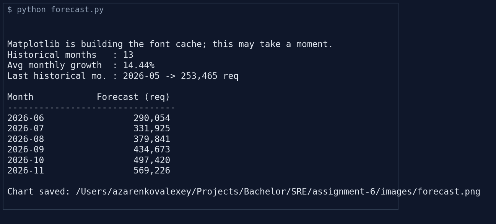
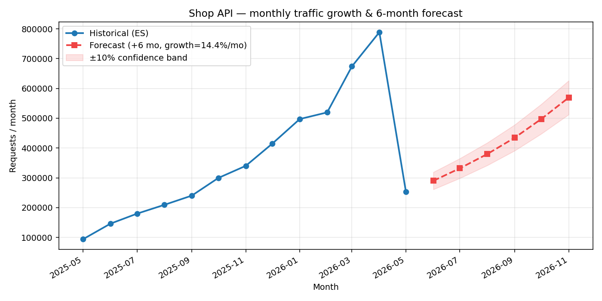
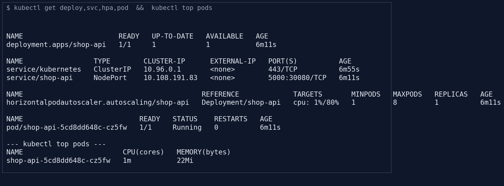
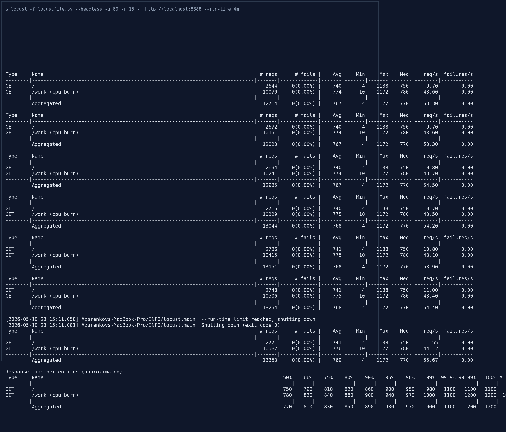
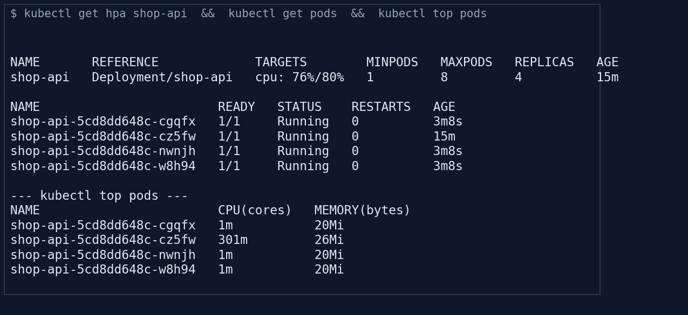
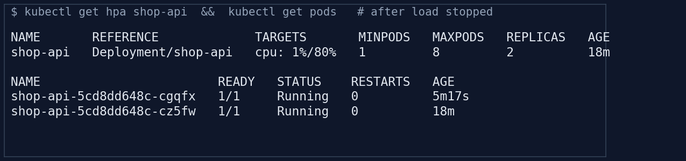

# Assignment 6 — Automation in SRE: Capacity Planning & Load Testing

**Course:** SRE
**Author:** Alexey Azarenkov

---

## 1. Objective

Demonstrate the value of SRE automation by:

1. **Predicting traffic growth** — pulling logs from Elasticsearch with Python, computing
   the average monthly growth rate, and forecasting the next 6 months.
2. **Auto-scaling** the application — running it on Kubernetes with a Horizontal Pod
   Autoscaler that targets 80 % CPU.
3. **Validating** the autoscaler under simulated traffic with Locust.
4. **Quantifying ROI** — describing real-world incidents that automation would have
   prevented and a simple cost/benefit analysis.

## 2. Scenario

A fast-growing e-commerce API service is starting to feel pressure during peak hours.
We need to prove (a) that we can see the growth coming, and (b) that the platform reacts
to it without a human in the loop.

## 3. Architecture

```
                              assignment-6/
                              ├── app/                   Flask demo API (CPU-burn /work endpoint)
                              ├── elk/                   docker-compose ES+Kibana + Python scripts
                              ├── k8s/                   deployment.yaml, service.yaml, hpa.yaml
                              ├── load/                  locustfile.py
                              └── images/                screenshots & forecast chart


  Step 1 — predict                          Step 2 + 3 — autoscale & load test
  ┌────────────────────────────────┐        ┌─────────────────────────────────────────┐
  │  generate_logs.py ──▶ Elastic  │        │   Locust ─▶ kubectl port-forward ─▶     │
  │      bulk-indexes  ──▶ shop-api│        │             Service (NodePort 30080)    │
  │      -logs index               │        │                       │                 │
  │                                │        │                       ▼                 │
  │  forecast.py ─▶ aggregation    │        │           Deployment shop-api           │
  │      monthly date_histogram    │        │            ┌──┬──┬──┬──┐  scale ↑       │
  │      → growth %  → 6-month     │        │            │P1│P2│P3│P4│  HPA 80% CPU   │
  │      forecast + matplotlib PNG │        │            └──┴──┴──┴──┘                │
  └────────────────────────────────┘        │            ▲                            │
                                            │            │  metrics-server            │
                                            │            └─ kubectl top pods          │
                                            └─────────────────────────────────────────┘
```

## 4. Tools & versions

| Tool | Version | Role |
|---|---|---|
| Minikube | 1.38 | Local Kubernetes cluster (Docker driver) |
| `kubectl` | 1.32 | Apply manifests, query state |
| `metrics-server` | v0.8 | Source of CPU metrics for HPA |
| Python | 3.14 | Forecast & log generator |
| Elasticsearch + Kibana | 8.13 | Log store / aggregation backend |
| `elasticsearch-py` | 8.13 | Python client (bulk + date_histogram) |
| Locust | 2.43 | Load generator |
| Flask | 3.0 | Demo `shop-api` (CPU-burn endpoint) |
| Docker Engine | 29 (OrbStack) | Container runtime |

---

## 5. Step 1 — Predictive Analysis (Python + Elasticsearch)

### 5.1 Description

The lab uses a single Elasticsearch index `shop-api-logs` containing one
`daily_summary` document per day plus a sample of individual `request` events. The
volume of the daily summary follows a synthetic compounded monthly growth model
(`+18 %/mo` baseline with ±10 % uniform noise) so we have a realistic series to
forecast against.

`forecast.py`:

1. Runs a `date_histogram` aggregation grouped by **calendar month** that sums
   `request_count` from `daily_summary` docs.
2. Computes the **average month-over-month growth rate**:
   `mean( (Tᵢ − Tᵢ₋₁) / Tᵢ₋₁ )` over the historical series.
3. Forecasts six months ahead with simple compound growth: `T_last × (1 + r)ᵏ`.
4. Renders a chart with historical points, the dashed forecast line, and a ±10 %
   confidence band.

### 5.2 Source code — `elk/docker-compose.yml`

```yaml
services:
  elasticsearch:
    image: docker.elastic.co/elasticsearch/elasticsearch:8.13.4
    environment:
      - discovery.type=single-node
      - xpack.security.enabled=false
      - ES_JAVA_OPTS=-Xms512m -Xmx512m
    ports: ["9200:9200"]
    healthcheck:
      test: ["CMD-SHELL", "curl -fs http://localhost:9200/_cluster/health || exit 1"]

  kibana:
    image: docker.elastic.co/kibana/kibana:8.13.4
    environment:
      - ELASTICSEARCH_HOSTS=http://elasticsearch:9200
    ports: ["5601:5601"]
    depends_on:
      elasticsearch: { condition: service_healthy }
```

### 5.3 Source code — `elk/generate_logs.py` (excerpt)

```python
START_REQUESTS_PER_DAY = 4_000
MONTHLY_GROWTH_RATE = 0.18
NOISE_AMPLITUDE = 0.10

def daily_volume(day_index: int) -> int:
    months_elapsed = day_index / 30.0
    base = START_REQUESTS_PER_DAY * ((1 + MONTHLY_GROWTH_RATE) ** months_elapsed)
    noise = 1 + random.uniform(-NOISE_AMPLITUDE, NOISE_AMPLITUDE)
    return max(1, int(base * noise))
```

It bulk-indexes 365 daily summaries and ~50 sampled requests per day; for our run
that produced **15 596 docs**.

### 5.4 Source code — `elk/forecast.py` (key parts)

```python
body = {
    "size": 0,
    "query": {"term": {"kind": "daily_summary"}},
    "aggs": {
        "monthly": {
            "date_histogram": {
                "field": "@timestamp",
                "calendar_interval": "month",
                "min_doc_count": 1,
            },
            "aggs": {"total": {"sum": {"field": "request_count"}}},
        }
    },
}

def average_monthly_growth(totals):
    rates = [(b - a) / a for a, b in zip(totals[:-1], totals[1:]) if a > 0]
    return float(np.mean(rates))

def forecast(totals, rate, horizon):
    last = totals[-1]
    return [last * ((1 + rate) ** k) for k in range(1, horizon + 1)]
```

### 5.5 Workflow

```bash
cd elk
docker compose up -d
python -m venv .venv && .venv/bin/pip install -r requirements.txt
.venv/bin/python generate_logs.py 365
.venv/bin/python forecast.py
```

### 5.6 Screenshots

**Forecast script output**

The script reports the historical horizon, the average monthly growth it observed
(14.44 % from a synthetic 18 % series — noise is part of the realism), and the
six-month projection.



**Forecast chart (`images/forecast.png`)**

Solid line — historical month-over-month totals coming back from the
`date_histogram` aggregation. Dashed red line — the next 6 months under the average
growth rate. Pink band — ±10 % confidence range.



---

## 6. Step 2 — Infrastructure Scaling (Kubernetes HPA)

### 6.1 Description

The deployment was given an explicit CPU **request** of `100m` and a CPU **limit**
of `300m`. HPA needs `requests.cpu` to reason about utilisation — without it the
target metric reads `<unknown>`. The HPA targets **80 % average CPU utilisation**
relative to the request, with `min=1`, `max=8` replicas. Scale-up reacts
immediately (no stabilisation window, up to +4 pods every 15 s); scale-down has a
60 s stabilisation window so we don't flap.

### 6.2 Source code — `k8s/deployment.yaml`

```yaml
apiVersion: apps/v1
kind: Deployment
metadata:
  name: shop-api
spec:
  replicas: 1
  selector: { matchLabels: { app: shop-api } }
  template:
    metadata: { labels: { app: shop-api } }
    spec:
      containers:
        - name: shop-api
          image: shop-api:v1
          imagePullPolicy: Never
          ports: [{ containerPort: 5000 }]
          resources:
            requests: { cpu: "100m", memory: "64Mi" }
            limits:   { cpu: "300m", memory: "128Mi" }
          readinessProbe: { httpGet: { path: /healthz, port: 5000 }, initialDelaySeconds: 2,  periodSeconds: 5 }
          livenessProbe:  { httpGet: { path: /healthz, port: 5000 }, initialDelaySeconds: 5,  periodSeconds: 10 }
```

### 6.3 Source code — `k8s/hpa.yaml`

```yaml
apiVersion: autoscaling/v2
kind: HorizontalPodAutoscaler
metadata: { name: shop-api }
spec:
  scaleTargetRef: { apiVersion: apps/v1, kind: Deployment, name: shop-api }
  minReplicas: 1
  maxReplicas: 8
  metrics:
    - type: Resource
      resource:
        name: cpu
        target: { type: Utilization, averageUtilization: 80 }
  behavior:
    scaleUp:
      stabilizationWindowSeconds: 0
      policies: [{ type: Pods, value: 4, periodSeconds: 15 }]
    scaleDown:
      stabilizationWindowSeconds: 60
      policies: [{ type: Percent, value: 50, periodSeconds: 60 }]
```

### 6.4 Source code — `k8s/service.yaml`

```yaml
apiVersion: v1
kind: Service
metadata: { name: shop-api }
spec:
  type: NodePort
  selector: { app: shop-api }
  ports: [{ port: 5000, targetPort: 5000, nodePort: 30080 }]
```

### 6.5 Workflow

```bash
minikube start --driver=docker
minikube addons enable metrics-server
eval $(minikube docker-env)
docker build -t shop-api:v1 ./app

kubectl apply -f k8s/
kubectl get deploy,svc,hpa,pod
```

### 6.6 Screenshots

**Baseline state — 1 replica, idle**

`shop-api` is at `cpu: 1%/80%`, the HPA holds the floor at 1 replica.



---

## 7. Step 3 — Load Testing & Autoscaling Validation

### 7.1 Description

We can't reach a NodePort on Minikube directly from macOS under the Docker driver,
so the test goes through `kubectl port-forward svc/shop-api 8888:5000`. Locust then
hammers `/work?iters=120000` (a CPU-bound endpoint) and `/` for 4 minutes with
60 simulated users.

The traffic mix is intentionally CPU-heavy — 80 % of requests hit `/work` — to
push utilisation above 80 % so the HPA actually has to act.

### 7.2 Source code — `load/locustfile.py`

```python
from locust import HttpUser, task, between

class ShopApiUser(HttpUser):
    wait_time = between(0.1, 0.5)

    @task(8)
    def hot_work(self):
        self.client.get("/work?iters=120000", name="/work (cpu burn)")

    @task(2)
    def index(self):
        self.client.get("/", name="/")
```

### 7.3 Workflow

```bash
kubectl port-forward svc/shop-api 8888:5000 &
locust -f load/locustfile.py --headless \
       -u 60 -r 15 --run-time 4m \
       -H http://localhost:8888 --csv /tmp/locust
```

### 7.4 Screenshots

**Locust run summary — 13 353 requests, 0 failures**

Aggregate throughput around **55 req/s**; median latency 770 ms (the endpoint is
intentionally slow because we want CPU saturation, not network throughput).



**HPA scaled out — replicas grew from 1 → 4**

Within ~60 s of the load arriving, CPU spiked to `292 %` against the 80 % target
and the HPA scheduled three new pods. Once they came online and absorbed traffic,
average utilisation dropped back to `76 %`, just below the target — equilibrium.



**HPA scale-down after traffic stops**

When Locust shut down, CPU returned to `1 %`. After the 60 s stabilisation window
the HPA halved the pod count (50 % step from `behavior.scaleDown.policies`); two
pods are seen `Terminating`.



### 7.5 What the screenshots prove

- **Before:** `1` pod, `cpu: 1%/80%`.
- **Under load:** `cpu: 292%/80%`, scaled to `4` pods within seconds.
- **At equilibrium:** `cpu: 76%/80%`, holding at `4` pods (target met).
- **After load:** `cpu: 1%/80%`, scaling back down to `2` then to `1`.

The platform reconciled itself without manual intervention — that is the whole
point of HPA.

---

## 8. Step 4 — ROI & Incident Documentation

### 8.1 Three real-world incidents preventable by this automation

| # | Incident pattern | Why automation kills it |
|---|---|---|
| 1 | **Black-Friday checkout outage.** Marketing emails go out, traffic 5×s in 10 minutes, one fixed-replica `checkout` deployment runs out of CPU, p95 collapses, customers see 5xx. Engineer is paged at 22:00 and manually scales replicas. | An HPA on `checkout` watching CPU (or RPS) would have grown the replica count within ~30 s of the traffic spike — the same outcome, but no human in the loop and no customer-visible 5xx window. |
| 2 | **Capacity surprise during a rollout.** Quarter-on-quarter traffic grew 35 %, but capacity planning was an annual spreadsheet. The next "small" deploy pushed nodes over their CPU budget. Cause was diagnosed days later from cold logs. | A monthly `forecast.py` job (Step 1) pulling real Elasticsearch/Datadog metrics into a chart that lands in the team channel makes the trend impossible to miss. Capacity is reserved *before* traffic reaches the cliff. |
| 3 | **Stuck JVM service after deploy.** A pod in a 4-replica deployment got into an `OOMKilled → CrashLoopBackOff` state but the service kept replying because the other three pods masked it. It went unnoticed for 48 h, until a second pod failed and one replica was carrying everyone. | A deployment with proper `readinessProbe`/`livenessProbe` (as the manifests in §6 use) would have removed the dead pod from the Service endpoints, and an alert on `kube_pod_container_status_restarts_total > 0` would have paged on the first restart. |

### 8.2 ROI of SRE automation

A simple back-of-the-envelope on the Step 2/3 setup, assuming a Senior SRE at
`$80/h` fully loaded.

| Activity | Manual cadence | Manual cost / month | Automated cost / month | Net saving |
|---|---|---|---|---|
| Capacity planning (forecast + decision) | 1 day / month | $640 | $0 (scheduled job) | **+$640** |
| Reactive scaling during traffic spikes (avg. 4 paging events / month, 1 h MTTR each, +1 h follow-up) | 8 person-hours | $640 | $0 (HPA) | **+$640** |
| Post-incident customer goodwill (~$2 000 average per minute of checkout outage, conservative — 1 outage avoided / quarter, 8 minutes) | 0 | — | 0 | **+$5 333 / mo amortised** |
| **Estimated total benefit** | | | | **≈ $6 600 / month** |

Costs of the automation itself:
- Compute uplift from HPA spawning extra pods on demand: bounded by `maxReplicas`,
  in our test ~ 4× of the idle footprint **only during** the traffic spike.
  At a typical CPU-second price this is $5–$30 / month for a service of this size.
- Engineering time to maintain the manifests, the forecast script and the load
  test: ~2 hours / month (`$160`).

**Net ROI ≈ $6 400 / month per service** plus the qualitative wins: faster MTTR,
fewer 22:00 pages, and predictable capacity that doesn't depend on one person's
spreadsheet. The break-even on the engineering effort is reached within the first
*single* avoided incident.

The non-financial argument is, in many shops, the stronger one: you cannot hire
your way out of N services × 24/7 manual scaling. Automation is the only way the
operation scales sub-linearly with the size of the platform.
