# JobConnect - Job Finding Platform

## Project Overview

JobConnect is a comprehensive full-stack web application that connects job seekers with employers. The platform enables companies to post job listings and manage applicants, while candidates can search for jobs, save favorites, and track their applications. Built with modern web technologies, this project demonstrates proficiency in backend development, database design, authentication, and API implementation.

**Project Topic:** Job Finding and Recruitment Platform

**Key Features:**
- Secure user authentication and authorization with JWT
- Role-based access control (Job Seeker, Employer, Admin)
- User profile management with skills, education, and resume information
- Company profile creation and management
- Job posting with detailed requirements and responsibilities
- Advanced job search with multiple filters (location, type, salary, skills)
- Save jobs functionality for job seekers
- Job application system with cover letter and resume
- Application tracking with status updates (pending, reviewed, accepted, rejected)
- Employer dashboard for managing job postings and applicants

**Technology Stack:**

Backend:
- Node.js and Express.js for server-side development
- MongoDB with Mongoose ODM for database management
- JWT (JSON Web Tokens) for authentication
- bcryptjs for password hashing and encryption
- express-validator for input validation
- CORS for cross-origin resource sharing

Frontend:
- HTML5, CSS3, and Vanilla JavaScript (ES6+)
- Bootstrap 5 for responsive design
- RESTful API integration

## Setup Instructions

### Prerequisites

Before installation, ensure you have the following installed:
- Node.js (version 14.x or higher)
- MongoDB (version 4.x or higher)
- npm (Node Package Manager)
- Git

### Installation Steps

1. **Clone the Repository**
```bash
git clone <repository-url>
cd job-finding
```

2. **Install Dependencies**
```bash
npm install
```

This will install all required packages including:
- express
- mongoose
- bcryptjs
- jsonwebtoken
- dotenv
- cors
- express-validator
- nodemon (developer dependency)

3. **Configure Environment Variables**

Create a `.env` file in the root directory with the following configuration:
```env
PORT=5000
MONGODB_URI=mongodb://localhost:27017/job-finding
JWT_SECRET=your-super-secret-jwt-key-change-this-in-production
JWT_EXPIRE=7d
NODE_ENV=development
```

**Important:** Change `JWT_SECRET` to a strong, unique value in production.

4. **Start MongoDB Database**

Ensure MongoDB is running on your system:

Windows (if installed as service):
```bash
net start MongoDB
```

macOS/Linux:
```bash
sudo systemctl start mongod
```

Or start MongoDB manually:
```bash
mongod
```

5. **Run the Application**

Development mode (with auto-restart):
```bash
npm run dev
```

Production mode:
```bash
npm start
```

6. **Access the Application**

Open your web browser and navigate to:
```
http://localhost:5000
```

The application should now be running successfully.

### Project Structure

```
job-finding/
├── app/
│   ├── config/
│   │   ├── auth.config.js      # JWT configuration
│   │   └── db.config.js        # MongoDB connection settings
│   ├── controllers/            # Request handlers and business logic
│   │   ├── auth.controller.js
│   │   ├── user.controller.js
│   │   ├── company.controller.js
│   │   ├── job.controller.js
│   │   ├── application.controller.js
│   │   └── saved.controller.js
│   ├── middlewares/            # Custom middleware functions
│   │   ├── auth.middleware.js  # JWT verification
│   │   └── validation.middleware.js
│   ├── models/                 # Mongoose schemas and models
│   │   ├── user.model.js
│   │   ├── company.model.js
│   │   ├── job.model.js
│   │   ├── application.model.js
│   │   └── savedJob.model.js
│   └── routes/                 # API route definitions
│       ├── auth.routes.js
│       ├── user.routes.js
│       ├── company.routes.js
│       ├── job.routes.js
│       ├── application.routes.js
│       └── saved.routes.js
├── public/                     # Frontend files
│   ├── css/
│   │   └── style.css
│   ├── js/
│   │   ├── api.js
│   │   ├── auth.js
│   │   ├── jobs.js
│   │   ├── profile.js
│   │   ├── applications.js
│   │   ├── saved-jobs.js
│   │   ├── employer-dashboard.js
│   │   ├── my-company.js
│   │   ├── job-details.js
│   │   └── utils.js
│   └── *.html                  # HTML pages
├── .env                        # Environment variables (not in repo)
├── .gitignore
├── package.json
├── server.js                   # Application entry point
└── README.md
```

## Database Design

### Collections

The application uses MongoDB with the following five collections:

#### 1. Users Collection
Stores user authentication and profile information.

Fields:
- `username`: String (required, unique) - User's unique username
- `email`: String (required, unique) - User's email address
- `password`: String (required) - Hashed password using bcrypt
- `role`: String (required) - User role: "jobseeker", "employer", or "admin"
- `firstName`: String - User's first name
- `lastName`: String - User's last name
- `phone`: String - Contact phone number
- `location`: String - User's location
- `resumeUrl`: String - URL to uploaded resume
- `skills`: Array of Strings - User's skills
- `experience`: String - Work experience description
- `education`: String - Educational background
- `createdAt`: Date - Account creation timestamp
- `updatedAt`: Date - Last update timestamp

#### 2. Companies Collection
Stores company profiles created by employers.

Fields:
- `name`: String (required) - Company name
- `description`: String - Company description
- `website`: String - Company website URL
- `industry`: String - Industry sector
- `size`: String - Company size (1-10, 11-50, 51-200, 201-500, 501-1000, 1000+)
- `location`: String - Company location
- `logo`: String - Company logo URL
- `userId`: ObjectId (required) - Reference to User (employer who created it)
- `createdAt`: Date - Creation timestamp
- `updatedAt`: Date - Last update timestamp

#### 3. Jobs Collection
Stores job postings created by employers.

Fields:
- `title`: String (required) - Job title
- `description`: String (required) - Job description
- `company`: ObjectId (required) - Reference to Company
- `location`: String - Job location
- `type`: String - Employment type: "full-time", "part-time", "contract", "internship", "remote"
- `salary`: Object - Salary information
  - `min`: Number - Minimum salary
  - `max`: Number - Maximum salary
  - `currency`: String - Currency code (USD, EUR, etc.)
- `requirements`: Array of Strings - Job requirements
- `responsibilities`: Array of Strings - Job responsibilities
- `skills`: Array of Strings - Required skills
- `status`: String - Job status: "active", "closed", "draft"
- `postedBy`: ObjectId (required) - Reference to User (employer)
- `applicationsCount`: Number - Number of applications
- `createdAt`: Date - Posting timestamp
- `updatedAt`: Date - Last update timestamp

#### 4. Applications Collection
Stores job applications submitted by job seekers.

Fields:
- `job`: ObjectId (required) - Reference to Job
- `applicant`: ObjectId (required) - Reference to User (job seeker)
- `status`: String - Application status: "pending", "reviewed", "accepted", "rejected"
- `coverLetter`: String - Cover letter text
- `resumeUrl`: String - Resume URL
- `appliedAt`: Date - Application submission timestamp
- `updatedAt`: Date - Last status update timestamp

#### 5. SavedJobs Collection
Stores jobs bookmarked by job seekers.

Fields:
- `user`: ObjectId (required) - Reference to User
- `job`: ObjectId (required) - Reference to Job
- `savedAt`: Date - Bookmark timestamp

## API Documentation

### Base URL
```
http://localhost:5000/api
```

### Authentication Endpoints (Public)

#### Register User
**POST** `/auth/register`

Register a new user account with encrypted password.

Request Body:
```json
{
  "username": "john_doe",
  "email": "john@example.com",
  "password": "securePassword123",
  "role": "jobseeker"
}
```

Response (201 Created):
```json
{
  "message": "User registered successfully",
  "userId": "64f7b1a2c9d3e4f5a6b7c8d9"
}
```

#### Login User
**POST** `/auth/login`

Authenticate user and return JWT token.

Request Body:
```json
{
  "email": "john@example.com",
  "password": "securePassword123"
}
```

Response (200 OK):
```json
{
  "token": "eyJhbGciOiJIUzI1NiIsInR5cCI6IkpXVCJ9...",
  "user": {
    "id": "64f7b1a2c9d3e4f5a6b7c8d9",
    "username": "john_doe",
    "email": "john@example.com",
    "role": "jobseeker"
  }
}
```

---

### User Management Endpoints (Private)

**Authentication Required:** All endpoints require JWT token in Authorization header:
```
Authorization: Bearer <token>
```

#### Get User Profile
**GET** `/users/profile`

Retrieve the logged-in user's profile information.

Response (200 OK):
```json
{
  "id": "64f7b1a2c9d3e4f5a6b7c8d9",
  "username": "john_doe",
  "email": "john@example.com",
  "role": "jobseeker",
  "firstName": "John",
  "lastName": "Doe",
  "skills": ["JavaScript", "Node.js", "React"],
  "location": "New York, NY"
}
```

#### Update User Profile
**PUT** `/users/profile`

Update the logged-in user's profile information.

Request Body:
```json
{
  "firstName": "John",
  "lastName": "Doe",
  "phone": "+1234567890",
  "location": "New York, NY",
  "skills": ["JavaScript", "Node.js", "React", "MongoDB"],
  "experience": "5 years of full-stack development",
  "education": "BS in Computer Science"
}
```

Response (200 OK):
```json
{
  "message": "Profile updated successfully",
  "user": { ... }
}
```

#### Delete User Profile
**DELETE** `/users/profile`

Delete the logged-in user's account.

Response (200 OK):
```json
{
  "message": "Account deleted successfully"
}
```

---

### Company Management Endpoints (Private - Employer Only)

#### Create Company
**POST** `/companies`

Create a new company profile (Employer only).

Request Body:
```json
{
  "name": "Tech Solutions Inc",
  "description": "Leading technology solutions provider",
  "website": "https://techsolutions.com",
  "industry": "Technology",
  "size": "51-200",
  "location": "San Francisco, CA"
}
```

Response (201 Created):
```json
{
  "message": "Company created successfully",
  "company": { ... }
}
```

#### Get All Companies
**GET** `/companies`

Retrieve all companies with optional filtering.

Query Parameters:
- `page`: Page number (default: 1)
- `limit`: Results per page (default: 10)
- `search`: Search term for company name
- `industry`: Filter by industry

Example: `/companies?page=1&limit=10&industry=Technology`

Response (200 OK):
```json
{
  "companies": [...],
  "totalPages": 5,
  "currentPage": 1,
  "totalCompanies": 48
}
```

#### Get Company by ID
**GET** `/companies/:id`

Retrieve specific company details.

Response (200 OK):
```json
{
  "id": "64f7b1a2c9d3e4f5a6b7c8d9",
  "name": "Tech Solutions Inc",
  "description": "Leading technology solutions provider",
  "website": "https://techsolutions.com",
  "industry": "Technology",
  "size": "51-200",
  "location": "San Francisco, CA"
}
```

#### Update Company
**PUT** `/companies/:id`

Update company profile (Owner only).

Request Body:
```json
{
  "description": "Updated company description",
  "size": "201-500"
}
```

Response (200 OK):
```json
{
  "message": "Company updated successfully",
  "company": { ... }
}
```

#### Delete Company
**DELETE** `/companies/:id`

Delete company profile (Owner only).

Response (200 OK):
```json
{
  "message": "Company deleted successfully"
}
```

---

### Job Management Endpoints (Private)

#### Create Job Posting
**POST** `/jobs`

Create a new job posting (Employer only).

Request Body:
```json
{
  "title": "Senior Full-Stack Developer",
  "description": "We are seeking an experienced full-stack developer...",
  "company": "64f7b1a2c9d3e4f5a6b7c8d9",
  "location": "Remote",
  "type": "full-time",
  "salary": {
    "min": 80000,
    "max": 120000,
    "currency": "USD"
  },
  "requirements": [
    "5+ years of experience in web development",
    "Strong knowledge of JavaScript and Node.js"
  ],
  "responsibilities": [
    "Design and develop scalable web applications",
    "Collaborate with cross-functional teams"
  ],
  "skills": ["JavaScript", "Node.js", "React", "MongoDB"],
  "status": "active"
}
```

Response (201 Created):
```json
{
  "message": "Job created successfully",
  "job": { ... }
}
```

#### Get All Jobs (Search)
**GET** `/jobs`

Retrieve all jobs with advanced filtering.

Query Parameters:
- `page`: Page number (default: 1)
- `limit`: Results per page (default: 10)
- `search`: Search term for job title or description
- `location`: Filter by location
- `type`: Filter by job type (full-time, part-time, contract, internship, remote)
- `skills`: Comma-separated list of skills
- `salaryMin`: Minimum salary
- `salaryMax`: Maximum salary

Example: `/jobs?search=developer&type=full-time&location=Remote&skills=JavaScript,Node.js`

Response (200 OK):
```json
{
  "jobs": [...],
  "totalPages": 10,
  "currentPage": 1,
  "totalJobs": 95
}
```

#### Get Job by ID
**GET** `/jobs/:id`

Retrieve specific job details.

Response (200 OK):
```json
{
  "id": "64f7b1a2c9d3e4f5a6b7c8d9",
  "title": "Senior Full-Stack Developer",
  "description": "...",
  "company": { ... },
  "location": "Remote",
  "type": "full-time",
  "salary": { ... },
  "requirements": [...],
  "responsibilities": [...],
  "skills": [...],
  "status": "active",
  "applicationsCount": 15
}
```

#### Update Job
**PUT** `/jobs/:id`

Update job posting (Employer owner only).

Request Body:
```json
{
  "status": "closed",
  "description": "Updated description"
}
```

Response (200 OK):
```json
{
  "message": "Job updated successfully",
  "job": { ... }
}
```

#### Delete Job
**DELETE** `/jobs/:id`

Delete job posting (Employer owner only).

Response (200 OK):
```json
{
  "message": "Job deleted successfully"
}
```

#### Get Jobs by Company
**GET** `/jobs/company/:companyId`

Retrieve all jobs for a specific company.

Response (200 OK):
```json
{
  "jobs": [...],
  "totalJobs": 8
}
```

---

### Application Management Endpoints (Private)

#### Submit Job Application
**POST** `/applications`

Apply for a job (Job Seeker only).

Request Body:
```json
{
  "job": "64f7b1a2c9d3e4f5a6b7c8d9",
  "coverLetter": "I am very interested in this position because...",
  "resumeUrl": "https://example.com/resumes/john_doe.pdf"
}
```

Response (201 Created):
```json
{
  "message": "Application submitted successfully",
  "application": { ... }
}
```

#### Get My Applications
**GET** `/applications`

Retrieve all applications submitted by the logged-in user (Job Seeker).

Query Parameters:
- `page`: Page number (default: 1)
- `limit`: Results per page (default: 10)
- `status`: Filter by status (pending, reviewed, accepted, rejected)

Example: `/applications?status=pending`

Response (200 OK):
```json
{
  "applications": [...],
  "totalPages": 3,
  "currentPage": 1,
  "totalApplications": 25
}
```

#### Get Application by ID
**GET** `/applications/:id`

Retrieve specific application details.

Response (200 OK):
```json
{
  "id": "64f7b1a2c9d3e4f5a6b7c8d9",
  "job": { ... },
  "applicant": { ... },
  "status": "pending",
  "coverLetter": "...",
  "resumeUrl": "...",
  "appliedAt": "2024-01-15T10:30:00Z"
}
```

#### Update Application Status
**PUT** `/applications/:id`

Update application status (Employer only).

Request Body:
```json
{
  "status": "reviewed"
}
```

Status options: `pending`, `reviewed`, `accepted`, `rejected`

Response (200 OK):
```json
{
  "message": "Application status updated successfully",
  "application": { ... }
}
```

#### Withdraw Application
**DELETE** `/applications/:id`

Withdraw a job application (Applicant only).

Response (200 OK):
```json
{
  "message": "Application withdrawn successfully"
}
```

#### Get Applications for Job
**GET** `/applications/job/:jobId`

Retrieve all applications for a specific job (Employer owner only).

Response (200 OK):
```json
{
  "applications": [...],
  "totalApplications": 15
}
```

---

### Saved Jobs Endpoints (Private - Job Seeker Only)

#### Save a Job
**POST** `/saved`

Bookmark a job for later viewing.

Request Body:
```json
{
  "job": "64f7b1a2c9d3e4f5a6b7c8d9"
}
```

Response (201 Created):
```json
{
  "message": "Job saved successfully",
  "savedJob": { ... }
}
```

#### Get Saved Jobs
**GET** `/saved`

Retrieve all bookmarked jobs.

Query Parameters:
- `page`: Page number (default: 1)
- `limit`: Results per page (default: 10)

Response (200 OK):
```json
{
  "savedJobs": [...],
  "totalPages": 2,
  "currentPage": 1,
  "totalSaved": 12
}
```

#### Remove Saved Job
**DELETE** `/saved/:jobId`

Remove a job from bookmarks.

Response (200 OK):
```json
{
  "message": "Job removed from saved list"
}
```

---

### HTTP Response Codes

The API uses standard HTTP response codes:

- **200 OK**: Request successful
- **201 Created**: Resource created successfully
- **400 Bad Request**: Invalid request data or validation error
- **401 Unauthorized**: Missing or invalid authentication token
- **403 Forbidden**: Insufficient permissions for the action
- **404 Not Found**: Requested resource not found
- **500 Internal Server Error**: Server-side error

### Error Response Format

All errors follow a consistent format:

```json
{
  "error": "Error message description",
  "details": []
}
```

---

## Features and Screenshots

### 1. User Registration and Authentication

**Description:** Secure user registration with role selection (Job Seeker or Employer). Passwords are encrypted using bcrypt before storage. JWT tokens are issued upon successful login.

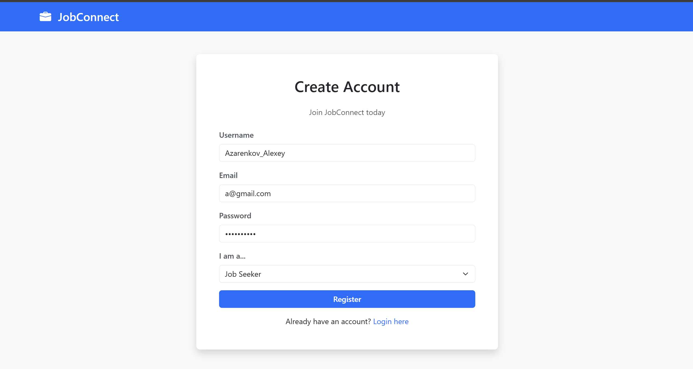

Key Features:
- Email and username validation
- Password strength requirements
- Role-based registration
- Email uniqueness check

---

### 2. User Login

**Description:** Authentication system that validates credentials and returns JWT token for subsequent API requests. Token expires after 7 days by default.

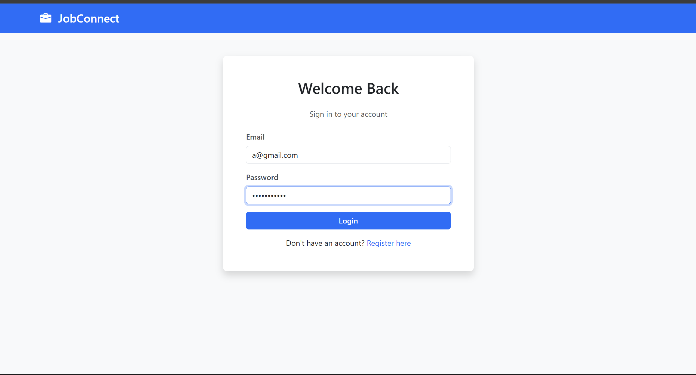

Key Features:
- Secure password verification
- JWT token generation
- Remember me functionality
- Error handling for invalid credentials

---

### 3. Job Seeker - Profile Management

**Description:** Job seekers can create and update their professional profile with skills, education, work experience, and resume. This information is visible to employers when reviewing applications.

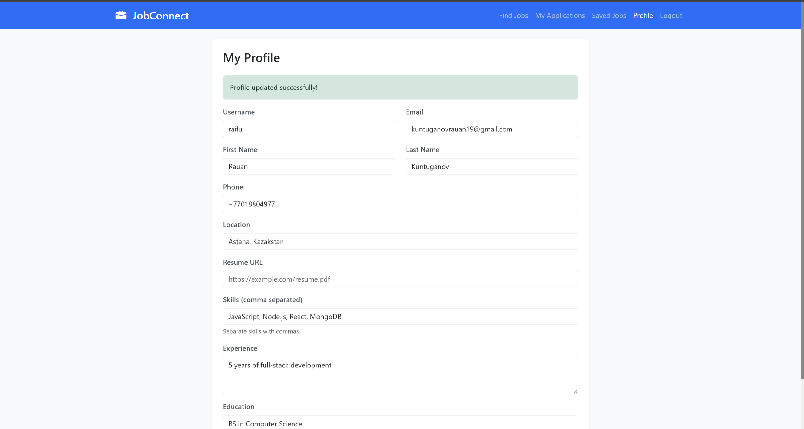

Key Features:
- Skill tags management
- Experience and education sections
- Resume URL upload
- Contact information
- Profile completion indicator

---

### 4. Job Search and Filtering

**Description:** Advanced job search with multiple filters including location, job type, salary range, and required skills. Search results are paginated and display relevant job information.

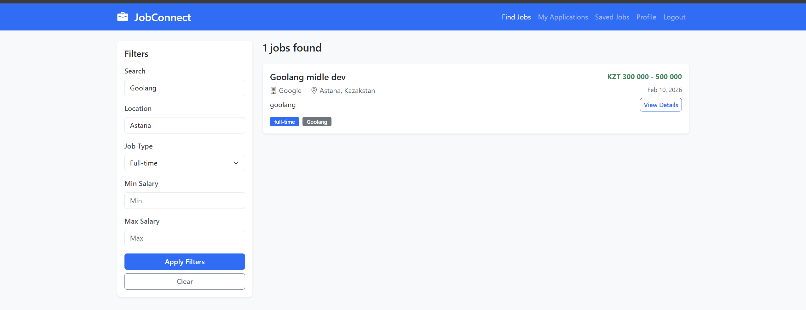

Key Features:
- Keyword search in title and description
- Multiple filter options
- Real-time search results
- Pagination for large result sets
- Sort by date posted

---

### 5. Job Details View

**Description:** Detailed view of job postings showing complete information including requirements, responsibilities, salary, company details, and application status.

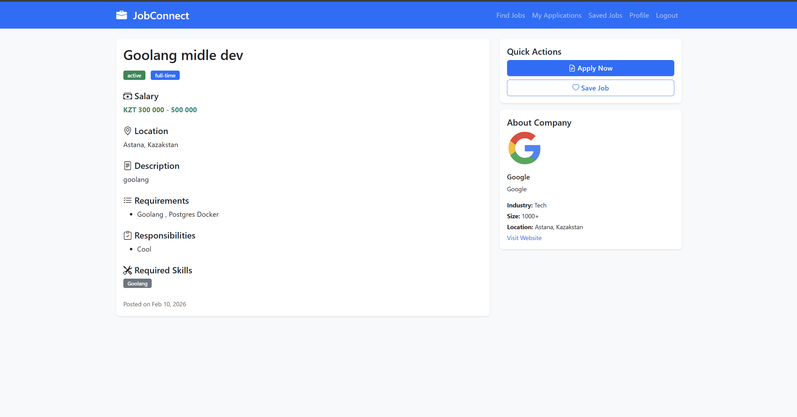

Key Features:
- Complete job information display
- Company profile preview
- Application button (if not already applied)
- Save job button
- Application status indicator

---

### 6. Save Favorite Jobs

**Description:** Job seekers can bookmark interesting jobs for later review. Saved jobs are accessible from a dedicated page and can be easily managed.

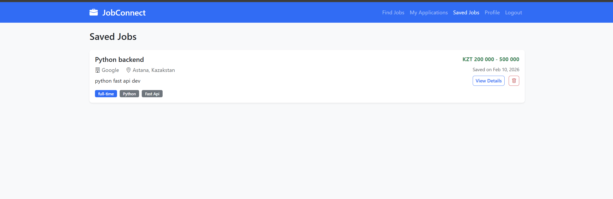

Key Features:
- One-click save/unsave
- Dedicated saved jobs page
- Quick access to saved positions
- Remove from saved list

---

### 7. Job Application Submission

**Description:** Job seekers can apply to positions by submitting a cover letter and resume URL. Applications are tracked and status updates are visible.

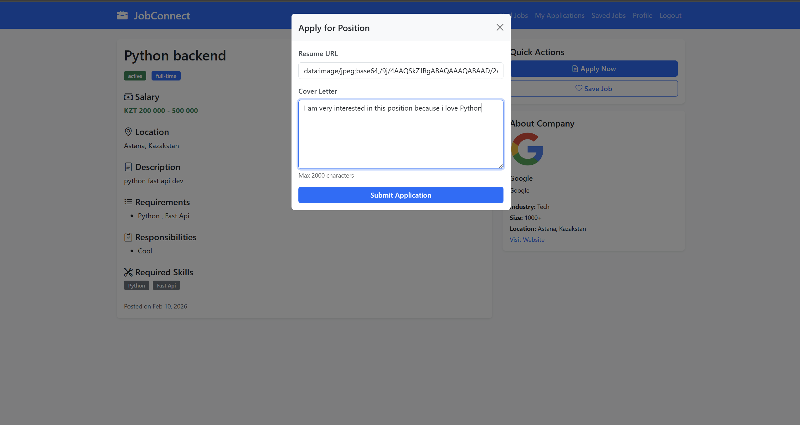

Key Features:
- Custom cover letter for each application
- Resume attachment
- Duplicate application prevention
- Instant application confirmation

---

### 8. Application Tracking

**Description:** Job seekers can view all their submitted applications with current status (pending, reviewed, accepted, rejected) and application dates.

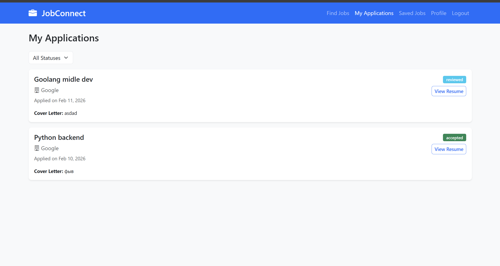

Key Features:
- Status indicators with color coding
- Filter by application status
- View application details
- Withdraw application option
- Application history

---

### 9. Employer - Company Profile Creation

**Description:** Employers can create detailed company profiles including description, industry, size, location, and website. This information is displayed on job postings.

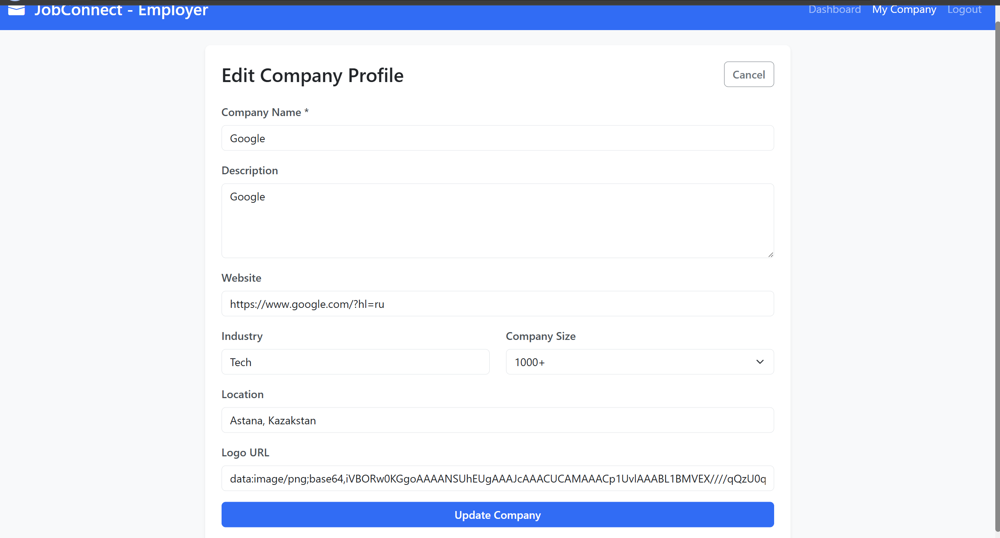

Key Features:
- Company information management
- Industry selection
- Company size categories
- Logo upload
- Website link

---

### 10. Employer - Job Posting Creation

**Description:** Employers can create comprehensive job postings with title, description, requirements, responsibilities, skills, salary range, and employment type.

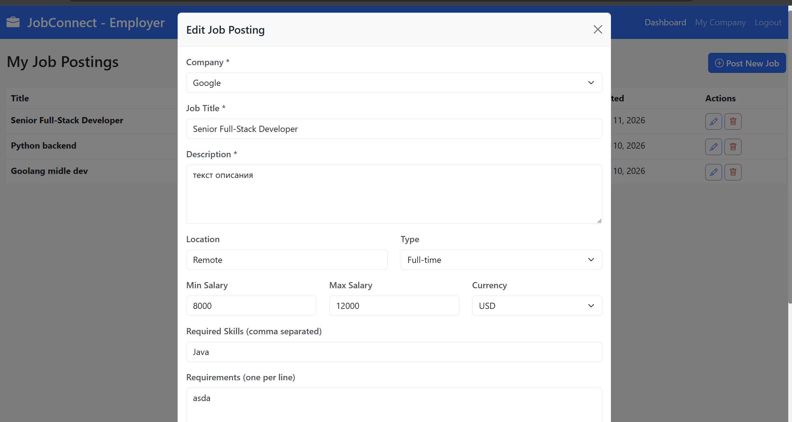

Key Features:
- Rich text job description
- Multiple requirement fields
- Skill tags
- Salary range specification
- Job type selection
- Draft/Active status

---

### 11. Employer Dashboard

**Description:** Centralized dashboard for employers showing all their job postings, application statistics, and quick actions for managing jobs.

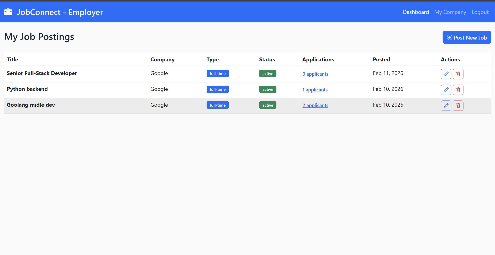

Key Features:
- List of all posted jobs
- Application count per job
- Edit/Delete job actions
- Close job posting option
- Job status management
- Quick statistics overview

---

### 12. Employer - Application Review

**Description:** Employers can view all applications for their job postings, review candidate profiles, and update application statuses.

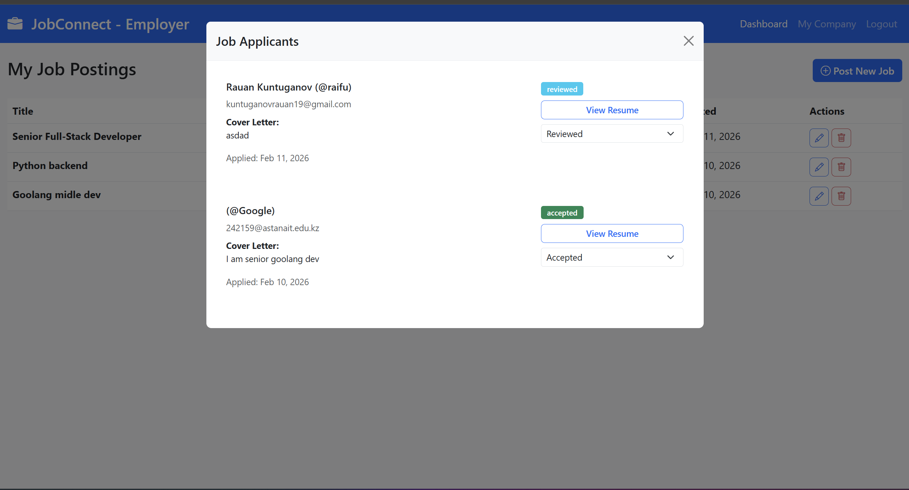

Key Features:
- List of applicants per job
- Candidate profile preview
- Cover letter viewing
- Resume access
- Status update (pending/reviewed/accepted/rejected)
- Filter applicants by status

---

## Security Features

The application implements comprehensive security measures:

1. **Password Security**
   - Passwords are hashed using bcrypt with salt rounds
   - Plain text passwords are never stored in the database
   - Password strength requirements enforced

2. **JWT Authentication**
   - Secure token-based authentication
   - Tokens expire after configurable period (default: 7 days)
   - Token validation middleware on protected routes
   - Bearer token schema in Authorization header

3. **Role-Based Access Control (RBAC)**
   - Three user roles: Job Seeker, Employer, Admin
   - Middleware checks user roles before granting access
   - Employers can only manage their own companies and jobs
   - Job seekers can only access their own applications
   - Admins have elevated privileges (if implemented)

4. **Input Validation**
   - express-validator middleware validates all inputs
   - Email format validation
   - Required field checks
   - Data type validation
   - XSS prevention through input sanitization

5. **Error Handling**
   - Global error handling middleware
   - Meaningful error messages without exposing sensitive data
   - Proper HTTP status codes
   - Validation error details for debugging

6. **Database Security**
   - MongoDB injection prevention through Mongoose
   - Parameterized queries
   - Schema validation
   - Connection string in environment variables

7. **Environment Variables**
   - Sensitive configuration stored in .env file
   - .env file excluded from version control
   - Separate configurations for development and production

---

## Project Requirements Compliance

This project fulfills all requirements for the final project:

**1. Project Setup (10 points)**
- Topic: Job Finding Platform
- Built with Node.js and Express
- Modular structure with separate routes, models, controllers, middleware, and config
- Complete README.md with setup instructions, overview, API docs, and screenshots

**2. Database (10 points)**
- MongoDB for data storage
- Five collections: User, Company, Job, Application, SavedJob
- Proper relationships and references between collections

**3. API Endpoints (20 points)**
- Public: POST /auth/register, POST /auth/login
- User Management: GET /users/profile, PUT /users/profile, DELETE /users/profile
- Resource Management (Jobs): POST /jobs, GET /jobs, GET /jobs/:id, PUT /jobs/:id, DELETE /jobs/:id
- Additional endpoints for companies, applications, and saved jobs

**4. Authentication and Security (15 points)**
- JWT authentication implemented
- Protected routes with token verification middleware
- bcrypt for password hashing

**5. Validation and Error Handling (5 points)**
- Input validation using express-validator
- Comprehensive error handling with appropriate status codes (400, 401, 403, 404, 500)
- Global error handling middleware

**6. Deployment (10 points)**
- Ready for deployment to Render, Railway, or Replit
- Environment variables for sensitive data
- Production-ready configuration

**7. Advanced Features**
- Role-Based Access Control (RBAC): Three roles with different permissions (5 points)
- Additional features: Advanced search, pagination, application tracking

---

## Available NPM Scripts

```bash
npm start       # Start production server
npm run dev     # Start development server with nodemon (auto-restart)
npm test        # Run tests (placeholder)
```

---

## Deployment

### Environment Variables for Production

Ensure the following environment variables are set on your deployment platform:

```env
PORT=5000
MONGODB_URI=<your-mongodb-atlas-connection-string>
JWT_SECRET=<strong-random-secret-key>
JWT_EXPIRE=7d
NODE_ENV=production
```

### Deployment Platforms

This application can be deployed to:
- **Render**: Connect GitHub repo and set environment variables
- **Railway**: Deploy directly from GitHub with automatic builds
- **Replit**: Import repository and configure secrets

### MongoDB Atlas Setup

For production deployment:
1. Create a MongoDB Atlas account
2. Create a new cluster
3. Set up database user with password
4. Whitelist IP addresses (or allow access from anywhere for development)
5. Get connection string and add to MONGODB_URI environment variable

---

## Team Contributions

All team members contributed equally to different aspects of the project:

- **Authentication & User Management**: Login, registration, profile management, JWT implementation
- **Job Listings & Search**: Job CRUD operations, advanced search and filtering, pagination
- **Applications & Companies**: Application system, company profiles, employer dashboard

All members have comprehensive understanding of the entire system architecture and can answer questions about any component.

---

## Future Enhancements

Potential improvements for the platform:
- Email notifications using Nodemailer with SMTP service
- File upload for resumes and company logos
- Real-time chat between employers and candidates
- Advanced analytics dashboard
- Job recommendations based on user profile
- Email verification for new accounts
- Password reset functionality
- Social media integration for job sharing

---

## License

ISC

---

## Contact

For questions or support, please contact the development team.
- ✅ CORS enabled

## Contributing

This is an academic project. For contributions:

1. Fork the repository
2. Create a feature branch
3. Commit your changes
4. Push to the branch
5. Create a Pull Request

## Team Members

- **Member 1**: Backend Developer - API, Authentication, Authorization
- **Member 2**: Database Engineer - MongoDB, Schemas, Business Logic
- **Member 3**: Frontend Developer - UI/UX, API Integration, Documentation

## License

ISC

## Support

For issues and questions, please create an issue in the repository.

---

**Made with ❤️ for academic purposes**
